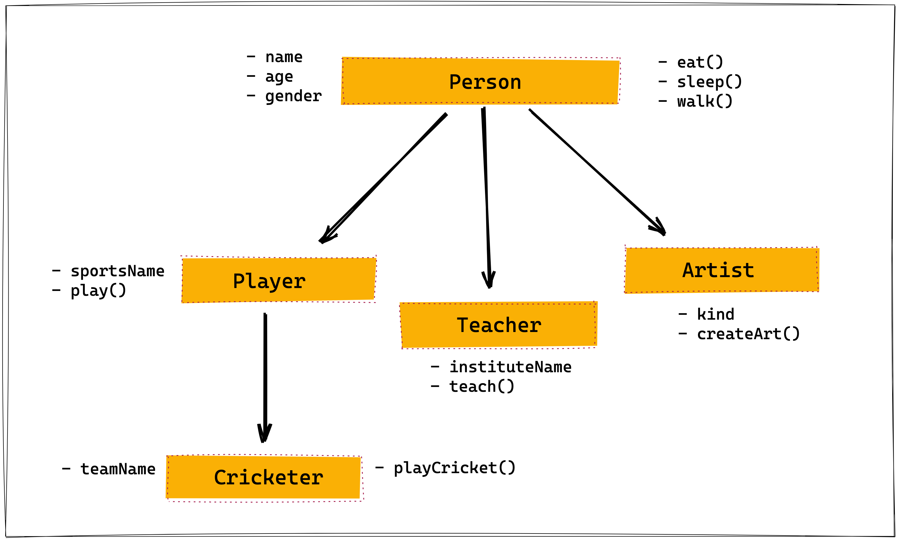

## Create Class

Convert the give image into class using inheritance.

- `name` is the property
- `eat()` is the method

Property ending with `()` is method. And others are properties.




```js

class person{
  constructor(name, age , gender){
    this.name = name;
    this.age = age ;
    this.gender = gender;
  };
  eat(){
    alert("I am Eating")
  }
  sleep(){
    alert("I am Sleeping")
  }
  walk(){
    alert("I am Walking")
  }
}

class player extends person{
  constructor(sportsName){
   this.sportsName = sportsName;
}
  play(){
  alert(`I am playing ${this.sportsName}`)
  }
}

class teacher extends person{
  constructor(instituteName){
   this.institudeName = institudeName
  }
    teach(){
      alert(`I am teaching in ${institudeName}`)
    }
}

class artist extends person{
  constructor(kind){
    this.kind = kind;
  }
   art(){
     alert(`I create ${this.kind} kind of art`)
   }
}

class teamName extends player{
  constructor(playCircket){
    this.playCircket = playCircket;
  }
  team(){
    alert(`I am team of ${playCirket}`)
  }
}

```